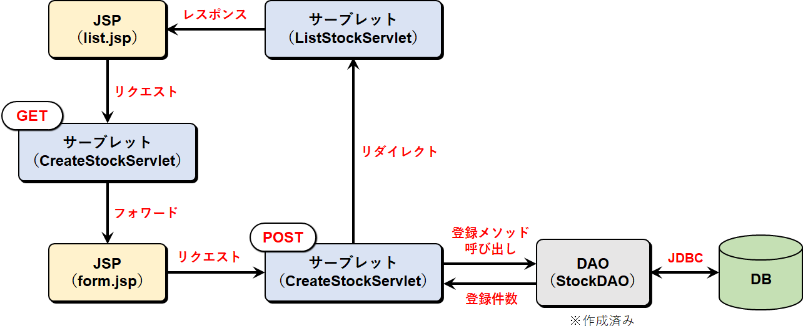
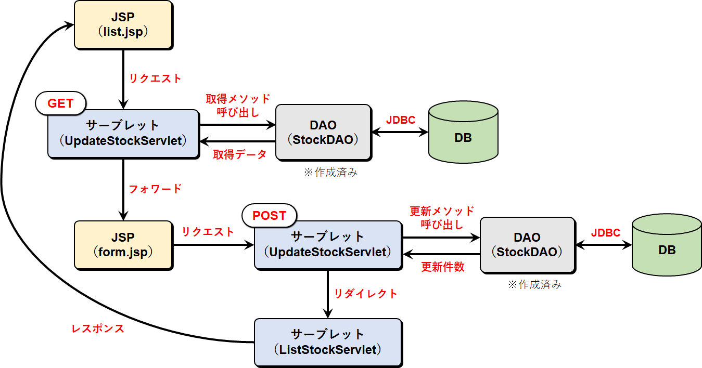

# 在庫管理アプリケーション（Servlet/JSP演習）

<span style="font-size:14pt">あるショップの在庫管理をするWebアプリケーションを作成する。</span>
- 在庫一覧表示
- 在庫登録処理
- 在庫更新処理
- 在庫削除処理

<br>

## プロジェクト構成

Eclipse上にstock_manageプロジェクトを作成し、以下の構成でファイルを作成する。

<table>
<tr><td>src/jp.shop.controller</td><td>サーブレット（コントローラ）</td></tr>
<tr><td>src/jp.shop.dao</td><td>DAO（Data Access Object）</td></tr>
<tr><td>src/jp.shop.dto</td><td>DTO（Data Transfer Object）</td></tr>
<tr><td>src/jp.shop</td><td>その他のクラス</td></tr>
<tr><td>WebContent/WEB-INF<br>WebContent</td><td>JSP</td></tr>
</table>

<br>

## 処理概要

### 1. 在庫一覧表示


#### 画面仕様

|項目名|コントロール|内容|
|------|----------|----|
|在庫一覧表示|リンク|在庫一覧画面を表示する|
|在庫登録|リンク|在庫登録画面を表示する|
|ID, 商品名, 数量|テキスト|STOCKテーブルの値を出力する|
|価格|テキスト|STOCKテーブルの値を出力する<br>￥999,999形式|
|更新日|テキスト|STOCKテーブルの値を出力する<br>yyyy-MM-dd HH:mm形式|
|DELETE|ボタン|対象レコードを削除する|

<br>

#### 処理手順


|ファイル名|内容|
|:-------:|----|
|ListStockServlet.java<br>（doGet）|①StockDAOのfindAllメソッドを呼び出し、在庫データを全件取得する<br>②取得した在庫データをリクエストに格納する<br>③JSP（list.jsp）へフォワードする|
|list.jsp|①リクエストにある在庫データを取り出し、一覧表示する（tableタグ）|

<br>
<hr>

### 2. 在庫登録処理


#### 画面仕様

|項目名|コントロール|内容|
|------|----------|----|
|商品名|テキストボックス（文字列）|20文字以内。必須入力。|
|価格|テキストボックス（数値）|0～1000000入力可。必須入力。|
|数量|テキストボックス（数値）|0～100入力可。必須入力。|
|SEND|ボタン|入力内容をSTOCKテーブルに登録し、在庫一覧画面を表示する|

<br>

#### 処理手順



|ファイル名|内容|
|:-------:|----|
|list.jsp|①在庫登録リンクのクリックでCreateStockServletにGET送信する|
|CreateStockServlet.java<br>（doGet）|①JSP（form.jsp）へフォワードする|
|form.jsp|①登録内容を入力する<br>②SENDボタンクリックでCreateStockServletにPOST送信する|
|CreateStockServlet.java<br>（doPost）|①リクエストからパラメータ（登録画面の入力値）を取り出す<br>②Stockインスタンスを生成し、登録内容を格納する<br>③StockDAOのcreateメソッドを呼び出し、在庫データを登録する<br>④ListStockServletへリダイレクトする|

<br>
<hr>

### 3. 在庫更新処理


#### 画面仕様

|項目名|コントロール|内容|
|------|----------|----|
|商品名|テキストボックス（文字列）|更新対象データの商品名を初期表示。20文字以内。必須入力。|
|価格|テキストボックス（数値）|更新対象データの価格を初期表示。0～1000000入力可。必須入力。|
|数量|テキストボックス（数値）|更新対象データの数量を初期表示。0～100入力可。必須入力。|
|SEND|ボタン|入力内容でSTOCKテーブルを更新し、在庫一覧画面を表示する|

<br>

#### 処理手順



|ファイル名|内容|
|:-------:|----|
|list.jsp|①一覧から更新したい在庫のIDリンクをクリックし、UpdateStockServletにGET送信する|
|UpdateStockServlet.java<br>（doGet）|①StockDAOのfindByIdメソッドを呼び出し、更新対象の在庫データを取得する<br>②取得した在庫データをリクエストに格納する<br>③JSP（form.jsp）へフォワードする|
|form.jsp|①リクエストにある在庫データを取り出し、商品名、価格、数量を各入力ボックスにセットする<br>②更新内容を入力する<br>③SENDボタンクリックでUpdateStockServletにPOST送信する|
|UpdateStockServlet.java<br>（doPost）|①リクエストからパラメータ（更新画面の入力値）を取り出す<br>②Stockインスタンスを生成し、更新内容を格納する<br>③StockDAOのupdateメソッドを呼び出し、対象の在庫データを更新する<br>④ListStockServletへリダイレクトする|

<br>
<hr>

### 4. 在庫削除処理

#### 処理手順


|ファイル名|内容|
|:-------:|----|
|list.jsp|①一覧から削除したい在庫のDELETEボタンをクリックし、DeleteStockServletにPOST送信する|
|DeleteStockServlet.java<br>（doPost）|①リクエストからパラメータ（削除対象の在庫のID）を取り出す<br>②Stockインスタンスを生成する<br>③StockDAOのdeleteメソッドを呼び出し、在庫データを削除する<br>④ListStockServletへリダイレクトする|

<br>

## テンプレート

**STOCKテーブル**

sample_shopデータベースを作成し、STOCKテーブルを作成する。

| 列名 | データ型 | PK | UK | FK | Not Null | 備考 |
|------|---------|:--:|:--:|:--:|:--------:|------|
| ID | INT(11) | 〇 |  |  |  | オートインクリメント |
| ITEM | VARCHAR(20) |  |  |  | 〇 |  |
| PRICE | INT(11) |  |  |  | 〇 |  |
| QUANTITY | INT(11) |  |  |  | 〇 |  |
| UPDATE_DATE | TIMESTAMP |  |  |  | 〇 | 既定値：現在日時 |

MySQLで以下のコマンド実行する。

```sql
CREATE TABLE STOCK (
    ID        INT(11) AUTO_INCREMENT PRIMARY KEY,
    ITEM      VARCHAR(20) NOT NULL,
    PRICE     INT(11) NOT NULL,
    QUANTITY  INT(11) NOT NULL,
    UPDATE_DATE TIMESTAMP NOT NULL DEFAULT CURRENT_TIMESTAMP ON UPDATE CURRENT_TIMESTAMP
);
```
```sql
INSERT INTO stock (item, price, quantity) VALUES ('ヨコクノート', 120, 20);
INSERT INTO stock (item, price, quantity) VALUES ('消せるボールペン', 180, 30);
INSERT INTO stock (item, price, quantity) VALUES ('カドケシ', 200, 10);
INSERT INTO stock (item, price, quantity) VALUES ('消せないランプ', 3980, 5);
INSERT INTO stock (item, price, quantity) VALUES ('昔治タオル', 2800, 8);
INSERT INTO stock (item, price, quantity) VALUES ('令和チョコレート', 100, 50);
INSERT INTO stock (item, price, quantity) VALUES ('無印ノートPC', 500000, 1);
INSERT INTO stock (item, price, quantity) VALUES ('水深10mで使えるキーボード', 18000, 2);
INSERT INTO stock (item, price, quantity) VALUES ('エアーマウス', 5680, 10);
```

<br>

**StockDAO.java（パッケージ：jp.shop.dao）** ※完成済み

```java
package jp.shop.dao;

import java.sql.Connection;
import java.sql.PreparedStatement;
import java.sql.ResultSet;
import java.sql.SQLException;
import java.util.ArrayList;
import java.util.List;

import jp.shop.dto.Stock;

public class StockDAO {

    protected Connection con;

    /**
     * コンストラクタ
     * @param con 接続情報
     */
    public StockDAO(Connection con) {
        this.con = con;
    }

    /**
     * findAllメソッド
     * @return List<Stock> 在庫情報
     */
    public List<Stock> findAll() {
        List<Stock> listItem = new ArrayList<>();
        String sql = "SELECT * FROM stock";

        try (PreparedStatement ps = con.prepareStatement(sql)) {

            ResultSet rs = ps.executeQuery();

            while (rs.next()) {
                Stock item = new Stock();
                item.setId(rs.getInt("id"));
                item.setItem(rs.getString("item"));
                item.setPrice(rs.getInt("price"));
                item.setQuantity(rs.getInt("quantity"));
                item.setUpdateDate(rs.getTimestamp("update_date"));
                listItem.add(item);
            }

        } catch (SQLException e) {
            e.printStackTrace();
        }
        return listItem;
    }

    /**
     * findByIdメソッド
     * @param id ID
     * @return Stock 在庫情報
     */
    public Stock findById(int id) {
        Stock stock = null;
        String sql = "SELECT * FROM stock WHERE id = ?";

        try (PreparedStatement ps = con.prepareStatement(sql)) {

            ps.setInt(1, id);

            ResultSet rs = ps.executeQuery();

            if (rs.next()) {
                stock = new Stock();
                stock.setId(rs.getInt("id"));
                stock.setItem(rs.getString("item"));
                stock.setPrice(rs.getInt("price"));
                stock.setQuantity(rs.getInt("quantity"));
                stock.setUpdateDate(rs.getTimestamp("update_date"));
            }

        } catch (SQLException e) {
            e.printStackTrace();
        }
        return stock;
    }

    /**
     * createメソッド
     * @param stock 在庫情報
     * @return int 登録件数
     */
    public int create(Stock stock) {
        int result = 0;
        String sql = "INSERT INTO stock (item, price, quantity) VALUES (?, ?, ?)";

        try (PreparedStatement ps = con.prepareStatement(sql)) {

            ps.setString(1, stock.getItem());
            ps.setInt(2, stock.getPrice());
            ps.setInt(3, stock.getQuantity());

            result = ps.executeUpdate();

        } catch (SQLException e) {
            e.printStackTrace();
        }
        return result;
    }

    /**
     * updateメソッド
     * @param stock 在庫情報
     * @param id 更新対象ID
     * @return int 更新件数
     */
    public int update(Stock stock, int id) {
        int result = 0;
        String sql = "UPDATE stock SET item = ?, price = ?, quantity = ? WHERE id = ?";

        try (PreparedStatement ps = con.prepareStatement(sql)) {

            ps.setString(1, stock.getItem());
            ps.setInt(2, stock.getPrice());
            ps.setInt(3, stock.getQuantity());
            ps.setInt(4, id);

            result = ps.executeUpdate();

        } catch (SQLException e) {
            e.printStackTrace();
        }
        return result;
    }

    /**
     * deleteメソッド
     * @param id 削除対象ID
     * @return int 削除件数
     */
    public int delete(int id) {
        int result = 0;
        String sql = "DELETE FROM stock WHERE id = ?";

        try (PreparedStatement ps = con.prepareStatement(sql)) {

            ps.setInt(1, id);
            result = ps.executeUpdate();

        } catch (SQLException e) {
            e.printStackTrace();
        }
        return result;
    }
}
```

<br>

**Stock.java（パッケージ：jp.shop.dto）** ※完成済み

```java
package jp.shop.dto;

import java.sql.Timestamp;

public class Stock {

    private int id;
    private String item;
    private int price;
    private int quantity;
    private Timestamp updateDate;

    public Stock() {

    }

    public Stock(String item, int price, int quantity) {
        this.item = item;
        this.price = price;
        this.quantity = quantity;
    }

    public int getId() {
        return id;
    }
    public void setId(int id) {
        this.id = id;
    }
    public String getItem() {
        return item;
    }
    public void setItem(String item) {
        this.item = item;
    }
    public int getPrice() {
        return price;
    }
    public void setPrice(int price) {
        this.price = price;
    }
    public int getQuantity() {
        return quantity;
    }
    public void setQuantity(int quantity) {
        this.quantity = quantity;
    }
    public Timestamp getUpdateDate() {
        return updateDate;
    }
    public void setUpdateDate(Timestamp updateDate) {
        this.updateDate = updateDate;
    }

}
```

<br>

**style.css（フォルダ：WebContent/css）** ※完成済み

```css
header {
    color: #FFF;
    text-shadow: 3px 3px 3px #000;
    text-align: center;
    background-color: #005FFF;
    width: 100%;
    height: 15%;
    padding: 1px 0px;
}

nav {
    background-color: #EEEEEE;
    width: 15%;
    height: 560px;
    margin-top: 10px;
    margin-bottom: 10px;
    float: left;
}

nav div {
    color: #FFF;
    background-color: #000;
    text-align: center;
    padding-top: 8px;
    height: 30px;
}

article {
    width: 80%;
    height: 550px;
    margin-top: 10px;
    margin-bottom: 10px;
    margin-left: 10px;
    padding: 5px 20px;
    float: left;
}

footer {
    color: #FFF;
    text-shadow: 1px 1px 3px #000;
    text-align: center;
    background-color: #005FFF;
    width: 100%;
    height: 25px;
    clear: both;
}

input[type="number"] {
    width: 100px;
    text-align: right;
}

a {
    text-decoration: none;
    color: #0000FF;
}

.block-center {
    margin: auto;
}

.btn-delete {
    border-radius: 5px;
    padding: 3px 8px;
    background-color: #FFBEDA;
    border-color: #FFBEDA;
}

.btn-default {
    border-radius: 5px;
    padding: 3px 8px;
}

.form-text {
    width: 400px;
    height: 25px;
    border-radius: 5px;
}

.form-number {
    width: 150px;
    height: 25px;
    border-radius: 5px;
}

.box {
    background-color: orange;
    border-radius: 10px;
    box-shadow: 2px 2px 2px;
    width: 40%;
    height: 300px;
}

.table-list {
    border-collapse: collapse;
    box-shadow: 1px 1px 2px;
    background-color: #FFF;
    white-space: nowrap;
    height: 300px;
    overflow-y: scroll;
}

.table-list th, .table-list td {
    border-collapse: collapse;
    border: solid 1px #000;
    padding: 2px 5px;
    table-layout:fixed;
}

.table-list thead {
    display: block;
}

.table-list tbody {
    display: block;
    overflow-y: scroll;
    height:400px;
}

.tr-active:hover {
    background-color: #EEEEEE;
}

.text-right {
    text-align: right;
}

.text-center {
    text-align: center;
}

.width-id {
    width: 50px;
}

.width-name {
    width: 300px;
}

.width-number {
    width: 120px;
}

.width-date {
    width: 180px;
}

.width-btn {
    width: 80px;
}

.font-red {
    color: #FF0000;
}
```

<br>

**list.jsp（在庫一覧画面）**

※在庫データが一覧表示されるように修正してください。

```html
<%@ page contentType="text/html; charset=UTF-8"%>
<!DOCTYPE html>
<html>
<head>
<meta charset="UTF-8">
<title>在庫管理システム</title>
<link rel="stylesheet" href="css/style.css">
</head>
<body>
    <header>
        <h1>ケロノス雑貨 総本店</h1>
    </header>
    <nav>
        <div>
            <label>メニュー</label>
        </div>
        <ul>
            <li><a href="#">在庫一覧表示</a></li>
            <li><a href="#">在庫登録</a></li>
        </ul>
    </nav>
    <article>
        <div class="text-center">
            <h2>在庫一覧</h2>
        </div>
        <div>
            <table class="table-list block-center">
                <thead>
                    <tr>
                        <th class="width-id">ID</th>
                        <th class="width-name">商品名</th>
                        <th class="width-number">価格</th>
                        <th class="width-number">数量</th>
                        <th class="width-date">更新日</th>
                        <th class="width-btn"></th>
                    </tr>
                </thead>
                <tbody>
                    <tr class="tr-active">
                        <td class="width-id text-center"></td>
                        <td class="width-name"></td>
                        <td class="width-number text-right"></td>
                        <td class="width-number text-right"></td>
                        <td class="width-date text-center"></td>
                        <td class="width-btn text-center"></td>
                    </tr>
                </tbody>
            </table>
        </div>
    </article>
    <footer>
        <label>Copyright (c) 20xx. Kelonos Co, Ltd All Rights Reserved.</label>
    </footer>
</body>
</html>
```

<br>

**form.jsp（在庫登録画面、在庫更新画面）**

※在庫データの登録、更新ができるように修正してください。

```html
<%@ page contentType="text/html; charset=UTF-8"%>
<!DOCTYPE html>
<html>
<head>
<meta charset="UTF-8">
<title>在庫管理システム</title>
<link rel="stylesheet" href="css/style.css">
</head>
<body>
    <header>
        <h1>ケロノス雑貨 総本店</h1>
    </header>
    <nav>
        <div>
            <label>メニュー</label>
        </div>
        <ul>
            <li><a href="#">在庫一覧表示</a></li>
            <li><a href="#">在庫登録</a></li>
        </ul>
    </nav>
    <article>
        <div class="text-center">
            <h2>在庫登録</h2>
        </div>
        <form action="" method="">
            <table class="block-center">
                <tr>
                    <td class="text-right">商品名：</td>
                    <td><p><input type="text" class="form-text" name="item" placeholder=" 20文字以内" required></p></td>
                </tr>
                <tr>
                    <td class="text-right">価格：</td>
                    <td><p><input type="number" class="form-number" name="price" min="0" max="1000000" value="0" required></p></td>
                </tr>
                <tr>
                    <td class="text-right">数量：</td>
                    <td><p><input type="number" class="form-number" name="quantity" min="0" max="100" value="0" required></p></td>
                </tr>
                <tr><td colspan="2" class="text-center"><p><button type="submit" class="btn-default">SEND</button></p></td></tr>
            </table>
        </form>
    </article>
    <footer>
        <label>Copyright (c) 20xx. Kelonos Co, Ltd All Rights Reserved.</label>
    </footer>
</body>
</html>
```

<br>

[解答例](/answer/servlet-jsp-01.md)

[解答例（コネクションプール、EL式、JSTL）](/answer/servlet-jsp-02.md)
