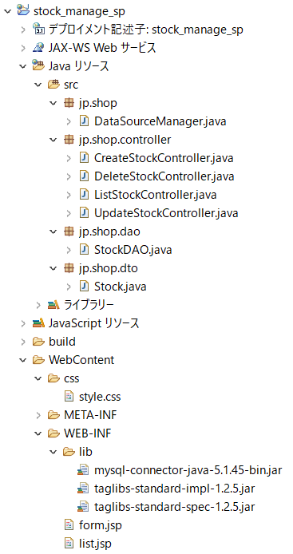

# 在庫管理アプリケーション（Servlet/JSP演習）

## 解答例

#### フォルダ構成



#### DataSourceManager.java（パッケージ：jp.shop）

```java
package jp.shop;

import java.sql.Connection;
import java.sql.DriverManager;
import java.sql.SQLException;

public class DataSourceManager {

    public static Connection getConnection() throws SQLException, ClassNotFoundException {
        String url = "jdbc:mysql://localhost:3306/sample_shop?useSSL=false";
        String user = "root";
        String password = "";

        Class.forName("com.mysql.jdbc.Driver");
        return DriverManager.getConnection(url, user, password);
    }

}
```

<br>

#### ListStockController.java（パッケージ：jp.shop.controller）

```java
package jp.shop.controller;

import java.io.IOException;
import java.sql.Connection;
import java.sql.SQLException;
import java.util.List;

import javax.servlet.ServletException;
import javax.servlet.annotation.WebServlet;
import javax.servlet.http.HttpServlet;
import javax.servlet.http.HttpServletRequest;
import javax.servlet.http.HttpServletResponse;
import javax.servlet.http.HttpSession;

import jp.shop.DataSourceManager;
import jp.shop.dao.StockDAO;
import jp.shop.dto.Stock;

/**
 * Servlet implementation class ListStockController
 */
@WebServlet("/list_stock")
public class ListStockController extends HttpServlet {
    private static final long serialVersionUID = 1L;

    /**
     * @see HttpServlet#doGet(HttpServletRequest request, HttpServletResponse response)
     */
    protected void doGet(HttpServletRequest request, HttpServletResponse response) throws ServletException, IOException {

        try (Connection con = DataSourceManager.getConnection()) {

            // 在庫データを全件取得する
            StockDAO dao = new StockDAO(con);
            List<Stock> listStock = dao.findAll();

            HttpSession session = request.getSession(false);
            if (session != null) {
                // セッションにメッセージがある場合、リクエストに格納し直す
                request.setAttribute("message", (String)session.getAttribute("message"));
                session.removeAttribute("message");
            }
            request.setAttribute("listStock", listStock);

            // 在庫一覧画面に遷移する
            request.getRequestDispatcher("/WEB-INF/list.jsp").forward(request, response);

        } catch (SQLException | ClassNotFoundException e) {
            e.printStackTrace();
        }
    }
}
```

<br>

#### CreateStockController.java（パッケージ：jp.shop.controller）

```java
package jp.shop.controller;

import java.io.IOException;
import java.sql.Connection;
import java.sql.SQLException;

import javax.servlet.ServletException;
import javax.servlet.annotation.WebServlet;
import javax.servlet.http.HttpServlet;
import javax.servlet.http.HttpServletRequest;
import javax.servlet.http.HttpServletResponse;
import javax.servlet.http.HttpSession;

import jp.shop.DataSourceManager;
import jp.shop.dao.StockDAO;
import jp.shop.dto.Stock;

/**
 * Servlet implementation class CreateStockController
 */
@WebServlet("/create_stock")
public class CreateStockController extends HttpServlet {
    private static final long serialVersionUID = 1L;

    /**
     * @see HttpServlet#doGet(HttpServletRequest request, HttpServletResponse response)
     */
    protected void doGet(HttpServletRequest request, HttpServletResponse response) throws ServletException, IOException {
        request.getRequestDispatcher("/WEB-INF/form.jsp").forward(request, response);
    }

    /**
     * @see HttpServlet#doPost(HttpServletRequest request, HttpServletResponse response)
     */
    protected void doPost(HttpServletRequest request, HttpServletResponse response)
            throws ServletException, IOException {

        request.setCharacterEncoding("UTF-8");

        // リクエストからパラメータを取り出す
        String item = request.getParameter("item");
        int price = Integer.parseInt(request.getParameter("price"));
        int quantity = Integer.parseInt(request.getParameter("quantity"));

        // 登録内容を保持するStockクラスのインスタンスを生成する
        Stock newStock = new Stock(item, price, quantity);
        HttpSession session = request.getSession();

        try (Connection con = DataSourceManager.getConnection()) {

            // 在庫情報を登録する
            StockDAO dao = new StockDAO(con);
            dao.create(newStock);

            session.setAttribute("message", "在庫情報を登録しました。");

        } catch (SQLException | ClassNotFoundException e) {
            session.setAttribute("message", "在庫情報の登録に失敗しました。");
        }

        // 在庫一覧処理へリダイレクトする
        response.sendRedirect("/stock_manage/list_stock");
    }
}
```

<br>

#### UpdateStockController.java（パッケージ：jp.shop.controller）

```java
package jp.shop.controller;

import java.io.IOException;
import java.sql.Connection;
import java.sql.SQLException;

import javax.servlet.ServletException;
import javax.servlet.annotation.WebServlet;
import javax.servlet.http.HttpServlet;
import javax.servlet.http.HttpServletRequest;
import javax.servlet.http.HttpServletResponse;
import javax.servlet.http.HttpSession;

import jp.shop.DataSourceManager;
import jp.shop.dao.StockDAO;
import jp.shop.dto.Stock;

/**
 * Servlet implementation class UpdateStockController
 */
@WebServlet("/update_stock")
public class UpdateStockController extends HttpServlet {
    private static final long serialVersionUID = 1L;

    /**
     * @see HttpServlet#doGet(HttpServletRequest request, HttpServletResponse response)
     */
    protected void doGet(HttpServletRequest request, HttpServletResponse response) throws ServletException, IOException {

        int id = 0;
        try {
            id = Integer.parseInt(request.getParameter("id"));
        } catch (NumberFormatException e) {
            // パラメータのIDが正しく設定されていない場合、在庫一覧処理へリダイレクトする
            response.sendRedirect("/stock_manage/list_stock");
            return;
        }

        try (Connection con = DataSourceManager.getConnection()) {

            // 更新対象の在庫データを取得する
            StockDAO dao = new StockDAO(con);
            Stock stock = dao.findById(id);

            if (stock == null) {
                // 対象データがない場合、在庫一覧処理へリダイレクトする
                response.sendRedirect("/stock_manage/list_stock");
                return;
            }

            request.setAttribute("stock", stock);
            request.getRequestDispatcher("/WEB-INF/form.jsp").forward(request, response);

        } catch (SQLException | ClassNotFoundException e) {
            response.sendRedirect("/stock_manage/list_stock");
            return;
        }
    }

    /**
     * @see HttpServlet#doPost(HttpServletRequest request, HttpServletResponse response)
     */
    protected void doPost(HttpServletRequest request, HttpServletResponse response) throws ServletException, IOException {

        request.setCharacterEncoding("UTF-8");

        // リクエストからパラメータを取り出す
        int id = Integer.parseInt(request.getParameter("id"));
        String item = request.getParameter("item");
        int price = Integer.parseInt(request.getParameter("price"));
        int quantity = Integer.parseInt(request.getParameter("quantity"));

        // 更新内容を保持するStockクラスのインスタンスを生成する
        Stock newStock = new Stock(item, price, quantity);
        HttpSession session = request.getSession();

        try (Connection con = DataSourceManager.getConnection()) {

            // 在庫情報を更新する
            StockDAO dao = new StockDAO(con);
            dao.update(newStock, id);

            session.setAttribute("message", "在庫情報を更新しました。");

        } catch (SQLException | ClassNotFoundException e) {
            session.setAttribute("message", "在庫情報の更新に失敗しました。");
        }

        // 在庫一覧処理へリダイレクトする
        response.sendRedirect("/stock_manage/list_stock");
    }
}
```

<br>

#### DeleteStockController.java（パッケージ：jp.shop.controller）

```java
package jp.shop.controller;

import java.io.IOException;
import java.sql.Connection;
import java.sql.SQLException;

import javax.servlet.ServletException;
import javax.servlet.annotation.WebServlet;
import javax.servlet.http.HttpServlet;
import javax.servlet.http.HttpServletRequest;
import javax.servlet.http.HttpServletResponse;
import javax.servlet.http.HttpSession;

import jp.shop.DataSourceManager;
import jp.shop.dao.StockDAO;

/**
 * Servlet implementation class DeleteStockController
 */
@WebServlet("/delete_stock")
public class DeleteStockController extends HttpServlet {
    private static final long serialVersionUID = 1L;

    /**
     * @see HttpServlet#doGet(HttpServletRequest request, HttpServletResponse response)
     */
    protected void doGet(HttpServletRequest request, HttpServletResponse response) throws ServletException, IOException {
        response.sendRedirect("/stock_manage/list_stock");
    }

    /**
     * @see HttpServlet#doPost(HttpServletRequest request, HttpServletResponse response)
     */
    protected void doPost(HttpServletRequest request, HttpServletResponse response) throws ServletException, IOException {

        // リクエストからパラメータを取り出す
        int id = Integer.parseInt(request.getParameter("id"));

        HttpSession session = request.getSession();

        try (Connection con = DataSourceManager.getConnection()) {

            // 在庫情報を削除する
            StockDAO dao = new StockDAO(con);
            dao.delete(id);

            session.setAttribute("message", "在庫情報を削除しました。");

        } catch (SQLException | ClassNotFoundException e) {
            session.setAttribute("message", "在庫情報の削除に失敗しました。");
        }

        // 在庫一覧処理へリダイレクトする
        response.sendRedirect("/stock_manage/list_stock");
    }
}
```

<br>

#### list.jsp

```html
<%@page import="java.text.NumberFormat"%>
<%@page import="java.text.SimpleDateFormat"%>
<%@page import="jp.shop.dto.Stock"%>
<%@page import="java.util.List"%>
<%@ page contentType="text/html; charset=UTF-8"%>
<!DOCTYPE html>
<html>
<head>
<meta charset="UTF-8">
<title>在庫管理システム</title>
<link rel="stylesheet" href="css/style.css">
<%
    List<Stock> listStock = (List<Stock>)request.getAttribute("listStock");
    String message = (String)request.getAttribute("message");
    NumberFormat nf = NumberFormat.getCurrencyInstance();
    SimpleDateFormat sdf = new SimpleDateFormat("yyyy-MM-dd HH:mm");
%>
</head>
<body>
    <header>
        <h1>ケロノス雑貨 総本店</h1>
    </header>
    <nav>
        <div>
            <label>メニュー</label>
        </div>
        <ul>
            <li><a href="/stock_manage/list_stock">在庫一覧表示</a></li>
            <li><a href="/stock_manage/create_stock">在庫登録</a></li>
        </ul>
    </nav>
    <article>
        <div class="text-center">
            <h2>在庫一覧</h2>
        </div>
        <div>
            <table class="table-list block-center">
                <thead>
                    <tr>
                        <th class="width-id">ID</th>
                        <th class="width-name">商品名</th>
                        <th class="width-number">価格</th>
                        <th class="width-number">数量</th>
                        <th class="width-date">更新日</th>
                        <th class="width-btn"></th>
                    </tr>
                </thead>
                <tbody>
                    <%
                        for (Stock stock : listStock) {
                    %>
                    <tr class="tr-active">
                        <td class="width-id text-center"><a href="/stock_manage/update_stock?id=<%=stock.getId()%>"><%=stock.getId()%></a></td>
                        <td class="width-name"><%=stock.getItem()%></td>
                        <td class="width-number text-right"><%=nf.format(stock.getPrice())%></td>
                        <td class="width-number text-right"><%=stock.getQuantity()%></td>
                        <td class="width-date text-center"><%= sdf.format(stock.getUpdateDate()) %></td>
                        <td class="width-btn text-center">
                            <form action="/stock_manage/delete_stock" method="post">
                                <input type="hidden" name="id" value="<%=stock.getId()%>">
                                <button type="submit" class="btn-delete">DELETE</button>
                            </form>
                        </td>
                    </tr>
                    <%
                        }
                    %>
                </tbody>
            </table>
        </div>
        <div class="text-center">
            <p class="font-red"><% if (message != null) { %><%= message %><% } %></p>
        </div>
    </article>
    <footer>
        <label>Copyright (c) 20xx. Kelonos Co, Ltd All Rights Reserved.</label>
    </footer>
</body>
</html>
```

<br>

#### form.jsp

```html
<%@page import="jp.shop.dto.Stock"%>
<%@page import="java.util.List"%>
<%@ page contentType="text/html; charset=UTF-8"%>
<!DOCTYPE html>
<html>
<head>
<meta charset="UTF-8">
<title>在庫管理システム</title>
<link rel="stylesheet" href="css/style.css">
<%
    Stock stock = (Stock)request.getAttribute("stock");
%>
</head>
<body>
    <header>
        <h1>ケロノス雑貨 総本店</h1>
    </header>
    <nav>
        <div>
            <label>メニュー</label>
        </div>
        <ul>
            <li><a href="/stock_manage/list_stock">在庫一覧表示</a></li>
            <li><a href="/stock_manage/create_stock">在庫登録</a></li>
        </ul>
    </nav>
    <article>
        <% if (stock == null) { %>
        <div class="text-center">
            <h2>在庫登録</h2>
        </div>
        <form action="/stock_manage/create_stock" method="post">
            <table class="block-center">
                <tr><td class="text-right">商品名：</td><td><p><input type="text" class="form-text" name="item" placeholder=" 20文字以内" required></p></td></tr>
                <tr><td class="text-right">価格：</td><td><p><input type="number" class="form-number" name="price" min="0" max="1000000" value="0" required></p></td></tr>
                <tr><td class="text-right">数量：</td><td><p><input type="number" class="form-number" name="quantity" min="0" max="100" value="0" required></p></td></tr>
                <tr><td colspan="2" class="text-center"><p><button type="submit" class="btn-default">SEND</button></p></td></tr>
            </table>
        </form>
        <% } else { %>
        <div class="text-center">
            <h2>在庫更新</h2>
        </div>
        <form action="/stock_manage/update_stock" method="post">
            <table class="block-center">
                <tr>
                    <td class="text-right">商品名：</td>
                    <td><p><input type="text" class="form-text" name="item" value="<%= stock.getItem() %>" required></p></td>
                </tr>
                <tr>
                    <td class="text-right">価格：</td>
                    <td><p><input type="number" class="form-number" name="price" min="0" value="<%= stock.getPrice() %>" required></p></td>
                </tr>
                <tr>
                    <td class="text-right">数量：</td>
                    <td><p><input type="number" class="form-number" name="quantity" min="0" max="100" value="<%= stock.getQuantity() %>" required></p></td>
                </tr>
                <tr><td colspan="2" class="text-center"><p><button type="submit" class="btn-default">SEND</button></p></td></tr>
            </table>
            <input type="hidden" name="id" value="<%= stock.getId() %>">
        </form>
        <% } %>
    </article>
    <footer>
        <label>Copyright (c) 20xx. Kelonos Co, Ltd All Rights Reserved.</label>
    </footer>
</body>
</html>
```
